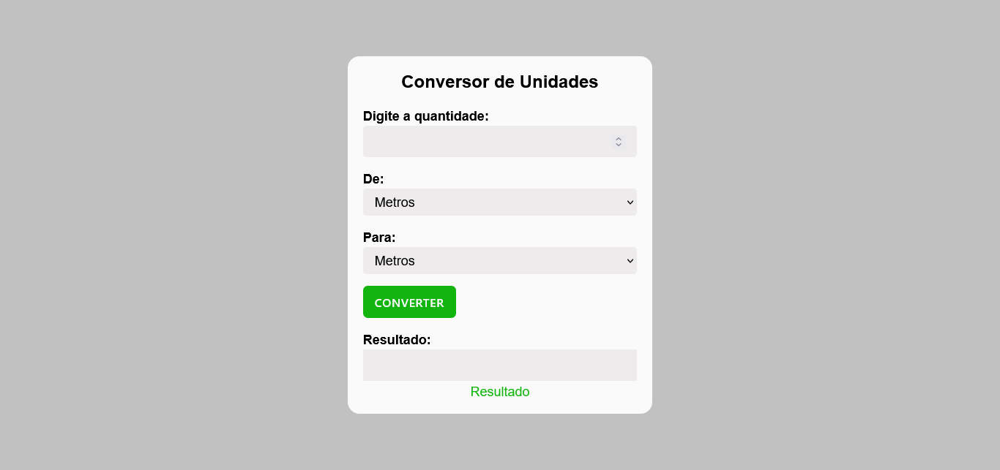

# unit converter

This project is a simple website for converting distance units.
You can easily convert values between kilometers (km), meters (m), centimeters (cm), and millimeters (mm).

---

## ✨ Features

- Conversion between km ↔ m ↔ cm ↔ mm.

- Clean and responsive interface.

- Input field for values and selection of source/target units.

---

## 🚀 Technologies

This project was developed with the following technologies:

- HTML
- SCSS 
- JavaScript
- [Custom font from Google Fonts](https://fonts.google.com/) 

---

## 📷 Screenshots

### Desktop


---

## 📦 How to use

1. Clone the repository:
```bash
git clone https://github.com/michaelprocha/alura-portfolio.git
```
2. Abra o arquivo `index.html` em qualquer navegador.

---

## 👨‍💻 Author

Made by [Michael Rocha](https://github.com/michaelprocha)

---

## 📄 License

This project is licensed under the MIT License. See the LICENSE file for more details.